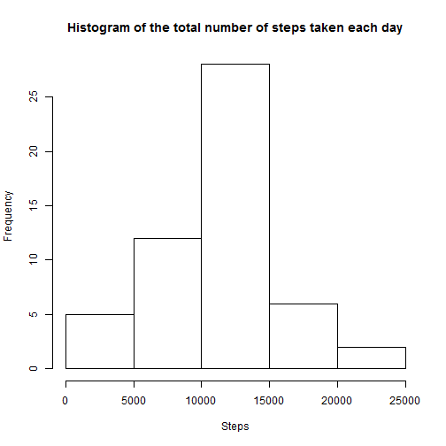
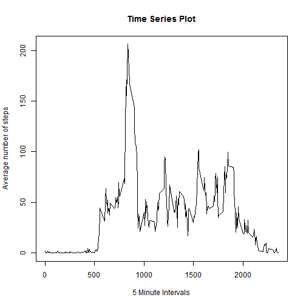
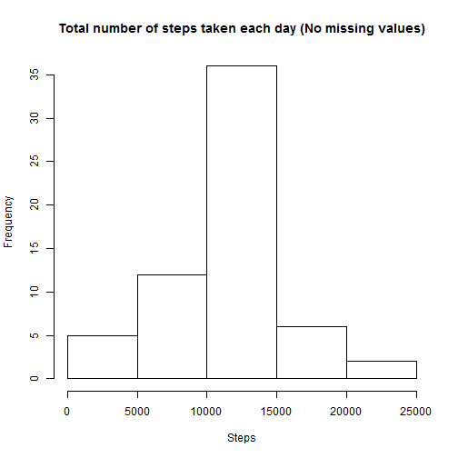
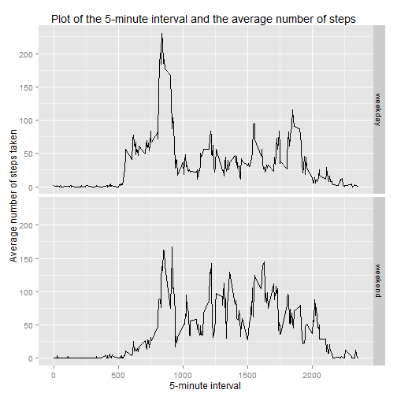

```r
library("plyr")
library("ggplot2")
```

##Loading and preprocessing the data

```r
# Open data from zip file
activity <- read.table(unz("activity.zip", "activity.csv"), header=T, sep=",", stringsAsFactors=F)
activity$date <- as.Date(activity$date, "%Y-%m-%d")
```

##What is the mean total number of steps taken per day?

```r
datahist <- aggregate(steps ~ date, data = activity, sum)
hist(datahist$steps,
     main= "Histogram of the total number of steps taken each day",
     xlab = "Steps")  
```

 

###The mean of the total numbers of steps taken per day is:

```r
mean(datahist$steps)
```

```
## [1] 10766.19
```
###The median of the total number of steps taken each day is:

```r
median(datahist$steps)
```

```
## [1] 10765
```

##What is the average daily activity pattern?

```r
intervalMean <- aggregate (steps ~ interval, data = activity, mean)
plot (steps ~ interval, intervalMean, type= "l",
      main = "Time Series Plot",
      xlab = "5 Minute Intervals",
      ylab = "Average number of steps")
```

 

### The 5-minute interval that in average contains the maximun number of steps is:

```r
intervalMean$interval[intervalMean$steps == max(intervalMean$steps)]
```

```
## [1] 835
```
  
## Imputing missing values
### The number of rows with NA is:

```r
table(is.na(activity$steps))[2]
```

```
## TRUE 
## 2304
```

### Imput the missing values in the data. The strategy is to imput the mean of the 5-minute interval.

```r
#create new dataset same as original
noMissData <- activity
#replace NA´s with the mean of the 5-minute interval
for (i in 1:nrow(noMissData)) {
        if (is.na(noMissData$steps[i])) {
                noMissData$steps[i] <- intervalMean$steps[intervalMean$interval == activity$interval[i]]
        }
}
```
### Make a histogram of the total number of steps taken each day

```r
datahist <- aggregate(steps ~ date, data = noMissData, sum)
hist(datahist$steps,
     main= "Total number of steps taken each day (No missing values)",
     xlab = "Steps")  
```

 
  
###The mean of the total numbers of steps taken (no missing data)

```r
mean(datahist$steps)
```

```
## [1] 10766.19
```
###The median of the total number of steps taken (no missing data)

```r
median(datahist$steps)
```

```
## [1] 10766.19
```
Using the strategy to imput the mean of the 5-minute intervals in the missing data has no impact in the mean of the number of daily steps and little impact in the median.

## Are there differences in activity patterns between weekdays and weekends?

```r
#create a new factor variable in the dataset with two levels - "weekday" and "weekend"
noMissData$day <- weekdays(noMissData$date)
noMissData$weekend <- as.factor(noMissData$day %in% c('Saturday','Sunday'))
levels(noMissData$weekend) <- c('weekday','weekend')
```


###Create a time plot of the 5-minute intervals and the average number of steps taken across "weekend" or "weekday"


```r
Plot <- aggregate(steps ~ weekend +interval, data = noMissData, FUN=mean)
ggplot(Plot, aes(x=interval,y=steps)) +
        xlab('5-minute interval') +
        ylab('Average number of steps taken') +
        ggtitle('Plot of the 5-minute interval and the average number of steps ') +
        geom_line() +
        facet_grid(weekend ~ .)
```

 
